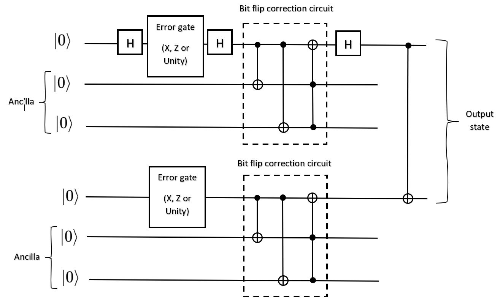

# QOSF Screening Task
## Task #2 - Bit flip and Sign flip correction
This is an implementation of a second screening task given by QOSF in order to enroll in a Quantum Mentorship Program

____________________________________________________
## TASK DESCRIPTION
The task was to start from a |0> upper qubit, which undergoes a Hadamard gate, and a |0> lower qubit - so the input state is actually |+0>. 
Then, apply to each qubit an error gate, which applies either a Pauli X, Pauli Z or Unity operators to each of the qubits.
After this, the code should perform error correction, and then a CNOT gate, so the output state should be an entangled Bell Phi Plus state. 

________________________________________________________________
## SOLUTION

Since the initial state, after the Hadamard gate, is |+0>, we can see that applying the error gate to the first qubit (|+>)  may result in a sign flip, whilst applying the error gate to the second qubit (|0>) may result in a bit flip. 

Therefore, the sign flip error correction circuit will be applied to correct the possible sign flip of the upper qubit, and after the circuit an additional Hadamard gate will be applied to return to the computational basis. 

In addition, the bit flip error correction circuit will be applied to account for and correct the possible bit flip of the lower qubit. 

Two ancilla qubits, two for each input qubit, will be initialized to |0> for each error correction circuit, and then discarded. 

_________________________________________________________________
## ERROR CORRECTION CIRCUIT
The circuit that is implemented in this project is shown below.



_________________________________________________________________
## HOW TO RUN THIS CODE

First, run
``` 
pip install -r /path/to/requirements.txt

```
to install the required packages. In this case, it's `parameterized` and `numpy` .

In order to check the code, there are tests in the [tests](tests) folder. 

The test which is responsible for running the whole error correction circuit is `test_CircuitAndCorrection`
and it is located in the [test_functions.py](tests/test_functions.py) module. 

There is also a `test_CircuitAndCorrectionRaises` test, which checks whether the program raises a `ValueError` when the sum of probabilities for the error gates exceeds one.

Right before the "main" test, called `test_CircuitAndCorrection`, there is a `@parameterized.expand` block, where different values of probability for an X and a Z gate are given as input, each combination of which creates a separate test. 

All tests can be run together to check all parts of the program in depth.

 Alternatively, only `test_CircuitAndCorrection` (with new or existing parameters) and `test_CircuitAndCorrectionRaises` can be run.
